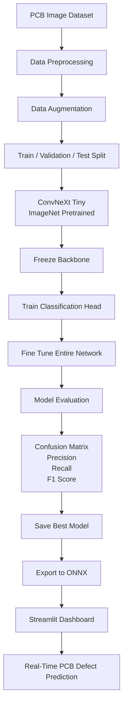

# 🧠 Methodology

This project follows a structured deep learning workflow for automated **PCB defect classification** using **ConvNeXt Tiny**, **transfer learning**, and **PyTorch**. The methodology is designed to ensure reproducibility, efficient training, and deployment readiness.

---

# 🔄 Overall Workflow

---

# 📂 1. Dataset Preparation

The dataset consists of **632 PCB inspection images** distributed across **8 defect classes**.

The dataset is organized using a folder-based structure compatible with **PyTorch's ImageFolder**.

### Key Steps

- Class-wise folder organization
- Automatic label generation
- 70% Training
- 15% Validation
- 15% Testing
- Prevention of data leakage

This structure provides a simple, reproducible, and scalable training pipeline.

---

# 🖼️ 2. Data Preprocessing

Before entering the model, every image undergoes preprocessing using **TorchVision** transformations.

### Training Pipeline

- Random Resized Crop
- Random Horizontal Flip
- Random Rotation
- Random Affine Translation
- Color Jitter
- Tensor Conversion
- ImageNet Normalization

### Validation & Testing

Only deterministic preprocessing is applied:

- Resize to **224 × 224**
- Tensor Conversion
- ImageNet Normalization

This ensures fair evaluation while improving generalization during training.

---

# 🧠 3. Transfer Learning Strategy

Instead of training from scratch, the project uses **ConvNeXt Tiny pretrained on ImageNet**.

Training is performed in two stages.

## Stage 1 — Feature Extraction

- ConvNeXt backbone frozen
- Only classifier head trained
- Faster convergence
- Reduced overfitting

## Stage 2 — Fine-Tuning

- Backbone unfrozen
- Entire network trained
- Smaller learning rate
- Better adaptation to PCB defect patterns

---

# ⚙️ 4. Model Training

The network is trained using a modern optimization pipeline.

### Training Configuration

| Component | Configuration |
|------------|--------------|
| Optimizer | AdamW |
| Learning Rate | 1e-4 |
| Fine-Tuning LR | 1e-5 |
| Scheduler | Cosine Annealing Learning Rate |
| Loss Function | CrossEntropy Loss + Label Smoothing |
| Batch Size | 16 |
| Epochs | 60 |
| Early Stopping | Patience = 8 |
| Mixed Precision | Automatic Mixed Precision (AMP) |

These techniques improve convergence while reducing overfitting.

---

# 📊 5. Model Evaluation

Performance is evaluated on the validation and test datasets using multiple metrics.

Evaluation includes:

- Classification Accuracy
- Precision
- Recall
- F1-Score
- Confusion Matrix
- Classification Report

Rather than relying solely on accuracy, class-wise metrics are used to analyze model performance across different PCB defect categories.

---

# 💾 6. Model Checkpointing

During training, checkpoints are automatically generated.

Artifacts include:

- Best Performing Model
- Last Training Checkpoint
- Training History
- Validation Metrics

This enables reproducibility and simplifies future fine-tuning.

---

# 📦 7. ONNX Export

To improve deployment portability, the trained PyTorch model is exported to **ONNX**.

The exported model can be used with:

- ONNX Runtime
- TensorRT
- Edge AI Platforms
- Embedded Inference Pipelines

This provides framework-independent deployment capabilities.

---

# 🖥️ 8. Interactive Streamlit Dashboard

The trained model is deployed through a user-friendly Streamlit application.

Dashboard Features

- Upload PCB Images
- Real-Time Prediction
- Confidence Score
- Top-3 Predictions
- Confidence Gauge
- Probability Distribution
- GPU Information
- Download Prediction Report

The dashboard enables quick visual validation and demonstration of the trained model.

---

# 🚀 Future Enhancements

Potential improvements include:

- Larger industrial PCB datasets
- Improved class balance
- Hyperparameter optimization
- Model quantization
- TensorRT optimization
- Edge-device deployment
- Knowledge distillation
- Explainable AI (Grad-CAM)
- Real-time defect localization
